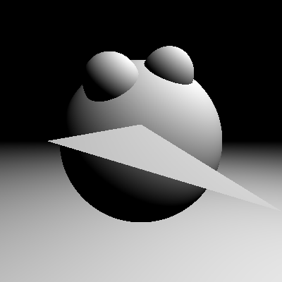
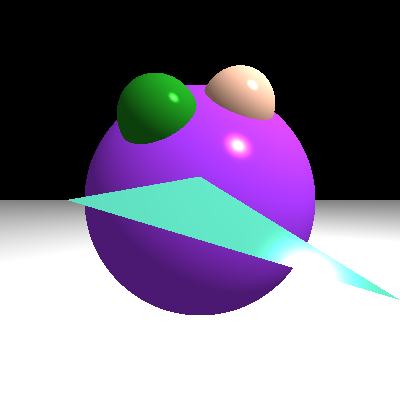
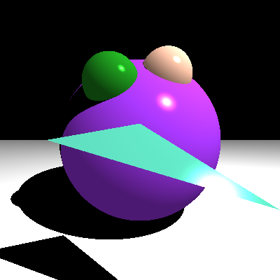
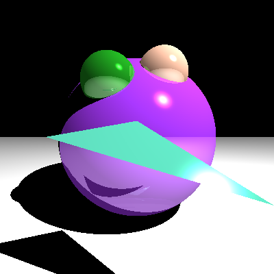

# HW3

## Mengmei He
## PSID: 1850021

### 1. Operaing System:
MacOS 10.15

### 2. IDE:
Xcode

### 3. Details:

1. Problem 1: Add files for New Shapes

(1) I added two new cpp files. One for triangle, and another one is for plain. 

-a. Triangle.cpp  

Triangle constructor takes in three vertices to define the position of the triangles, and one object color to define its original color. 
It has one funtion "intersect(const Ray &ray)" inherited from the Shape() class. Function intersect(const Ray &ray) returns the record of the point where ray hits the triangle. To get a hit on triangle, the hit time t must satisfy the equation: o + t * d = (1 - b1 - b2) * v0 + b1 * v1 + b2 * v2; 
I used Moller Trumbore Algorithm to determine the values of t, b1, and b2.  

t = (S2.dot(E2))/(S1.dot(E1)); 
b1 = (S1.dot(S))/(S1.dot(E1)); 
b2 = (S2.dot(ray.direction))/(S1.dot(E1)); 
where,  
E1 = v1 - v0; 
E2 = v2 - v0; 
S = ray.origin - v0; 
S1 = ray.direction.cross(E2); 
S2 = S.cross(E1); 

When t>=0 && b1 >= 0 && b2 >= 0 && (b1+b2)<=1, the ray will hit on the triangle.  
I record the hit point as: 
        result.t = t; 
        result.position = ray.origin + t * ray.direction; 
        result.normal = (-(v2-v0).cross(v1-v0)).normalized(); 

-b. Plain.cpp 

Plain constructor takes in a 3D point, a normal of the plain, and the object color to define its original color. It has one funtion "intersect(const Ray &ray)" inherited from the Shape() class. 
Combine the plain equation(P'- P).dot(Normal) = 0 and ray equation P'= ray.origin + t * ray.direction, I will get t = (P - ray.origin).dot(Normal)/(ray.direction.dot(Normal)); 

When t >= 0, there will be a hit on the plain. 
I record the hit point as: 
    result.t = t; 
    result.position = ray.origin + t * ray.direction; 
    result.normal = Normal.normalized(); 
    
(2) main.cpp: Add new shapes into list of shapes  

I add one big sphere, two small spheres, a triangle and one plain to the list of shapes.  

--------
2. Problem 2: Do Phong Shading---Scene::tracer()  
Set lightColor to (1,1,1) 

(1) Diffuse:  
diffuse = max(lightDir.dot(r.normal),0.0) * lightColor,  
where, 
r is the record of the closest hit point, 
lightDir = (lightPos - r.position).normalized(); 

(2) Ambient:  
ambient = ambientStrength * lightColor,  
where ambientStrength = 0.5; 

(3) Specular:  
specular = specularStrength * spec * lightColor,  
where specularStrength = 5,  
spec = pow(max(reflectedDir.dot(viewDir),0.0),128). //reflectedDir is the reflected ray of input ray about the normal. 

(4) Object color  
Apply object color to the result of (diffuse + ambient + specular).  
Each value in the result of (diffuse + ambient + specular) is multiplied by the corresponding value in "objectColor". 

----------
3. Problem 3: Do Shadow---Scene::tracer()  
The logic is:  
If the ray from camera has the closest hit on the same shape as the light has the closest hit, then that pixel will not be in shadow. 
Otherwise, The pixel will be in shadow. 

(1) Get a ray from lightPosition to the position where the ray from camera first hit on a shape. 
rayToLight.direction = r.position - lightPos; 
rayToLight.origin = lightPos; 

(2)Get the closest hit of "rayToLight". 
hit = closestHit(rayToLight); 
if(hit.shape != r.shape), where r.shape is the shape ray from camera has the closest hit on, 
then the result color of this pixel will be black (0,0,0). 
else, the result color will be rendered as what it should be (by phong shading). 

----------
4. Problem 4: Glossy Reflection---Scene::tracer()  
The way to solve this is: Add the color of the object that is hit by the reflected ray of the ray from camrea. 

(1) Get the reflected ray of the ray from camrea around r.normal.  
(a) reflectedRay.direction = ray.direction - 2*(ray.direction.dot(r.normal))*r.normal. 
Note: The glm::reflected() function is somehow not working here, so I use this reflection equation. 
(b)reflectedRay.origin = r.position - ray.direction/10000;  
Note: ray.direction/10000 is added because r.position is not exactly where the surface is. 

(2)Add the reflected color to the result using recursion 
result += 0.25 * trace(reflectedRay,reflectionTimes-1), 
where, reflectionTimes is the depth of the reflection. 

### 4. IMAGES

1. Shapes

2. Shading

3. Shadow

4. Reflection

### 5. Reference
https://learnopengl.com/Lighting/Basic-Lighting  
https://learnopengl.com/Advanced-Lighting/Shadows/Shadow-Mapping
